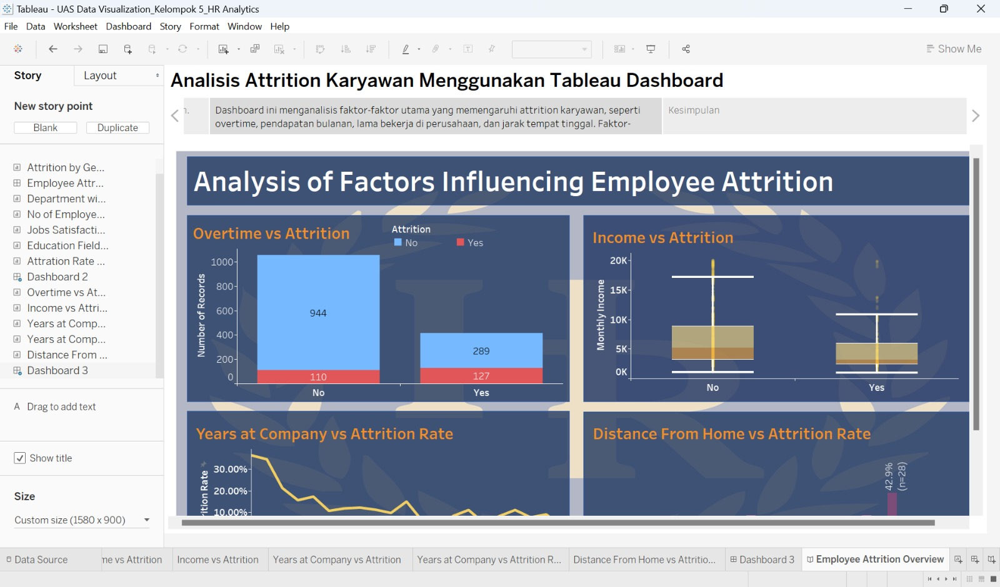

# Employee Attrition Analysis Dashboard

## Dashboard Preview

## Project Overview

Interactive Tableau dashboard for analyzing employee attrition patterns and workforce demographics.

## Key Performance Indicators

- Total Employees
- Attrition Rate
- Active Employees
- Average Age

## Key Business Questions

1. Which departments have the highest attrition?
2. How does attrition vary by age group?
3. Which job roles experience the highest turnover?

## Live Dashboard

[View Interactive Tableau Dashboard (https://public.tableau.com/views/UASDataVisualization_Kelompok5_AnalisisAttritionKaryawan/AAnalisisAttritionKaryawan)

## Tools Used

- Tableau Public
- Microsoft Excel
- Data Visualization
- HR Analytics
